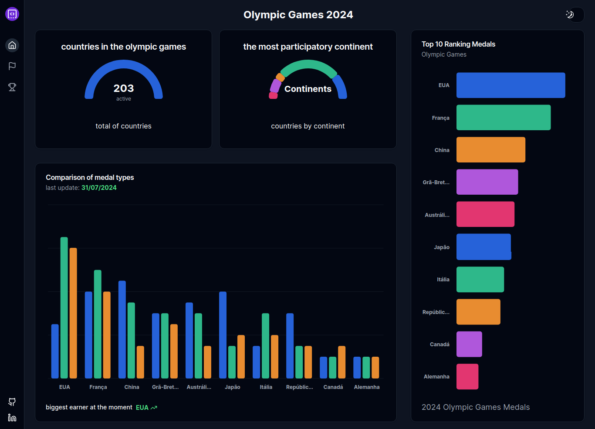

# Olympic Games 2024

## 🔥 Introduction

Dashboard with analyzes of the 2024 Olympics, with analyzes of the games, medals, countries and continents.

### ⚙️ Prerequisites

```
node
git
```

### 🔨 Installation Guide

Steps to install:

Step 1:

```
git clone https://github.com/Darlan0307/mp-hackathon-olimpiadas.git
```

Step 2:

```
cd mp-hackathon-olimpiadas
```

Step 3:

```
npm install
```

Step 4:

```
npm run dev
```

access the application locally at [localhost:3000](http://localhost:3000)

access the application in production [Hackathon Olimpiadas](https://mp-hackathon-olimpiadas.vercel.app/)

## 📦 Technologies used:

- 
- 
- 
- 

## 👷 Author

- **Darlna Martins** - [Web Developer](https://www.linkedin.com/in/darlan-martins-8a7956259/)

## 💡 Expressions of gratitude

- A public thank you to the staff at [Codante](https://codante.io/) for helping to develop the api that I used in the project.
